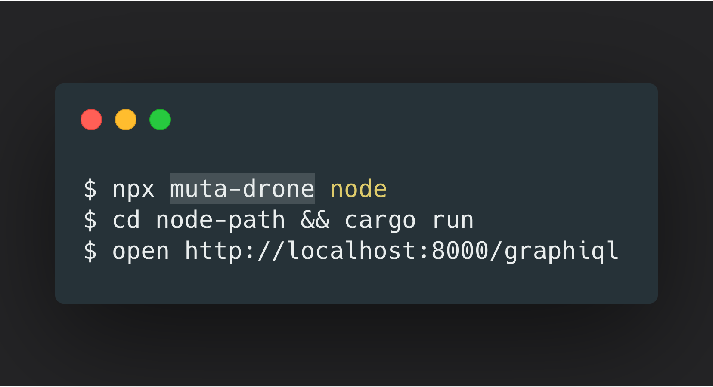

# drone

Standard Tooling for Muta framework

[](https://oclif.io)
[](https://npmjs.org/package/drone)
[](https://npmjs.org/package/drone)
[](https://github.com/yejiayu/drone/blob/master/package.json)



<!-- toc -->

- [Usage](#usage)
- [Commands](#commands)
  <!-- tocstop -->

# Usage

<!-- usage -->

```sh-session
$ npm install -g drone
$ drone COMMAND
running command...
$ drone (-v|--version|version)
drone/0.0.1 darwin-x64 node-v12.4.0
$ drone --help [COMMAND]
USAGE
  $ drone COMMAND
...
```

<!-- usagestop -->

# Commands

<!-- commands -->

- [`drone help [COMMAND]`](#drone-help-command)
- [`drone node`](#drone-node)
- [`drone service SERVICE_NAME`](#drone-service-service_name)

## `drone help [COMMAND]`

display help for drone

```
USAGE
  $ drone help [COMMAND]

ARGUMENTS
  COMMAND  command to show help for

OPTIONS
  --all  see all commands in CLI
```

_See code: [@oclif/plugin-help](https://github.com/oclif/plugin-help/blob/v2.2.3/src/commands/help.ts)_

## `drone node`

Create your blockchain with one click.

```
USAGE
  $ drone node

OPTIONS
  -h, --help  show CLI help

EXAMPLE
  $ drone node
```

_See code: [src/commands/node.ts](https://github.com/yejiayu/drone/blob/v0.0.1/src/commands/node.ts)_

## `drone service SERVICE_NAME`

Crate servive template

```
USAGE
  $ drone service SERVICE_NAME

OPTIONS
  -h, --help  show CLI help

EXAMPLE
  $ drone service hello
```

_See code: [src/commands/service.ts](https://github.com/yejiayu/drone/blob/v0.0.1/src/commands/service.ts)_

<!-- commandsstop -->
